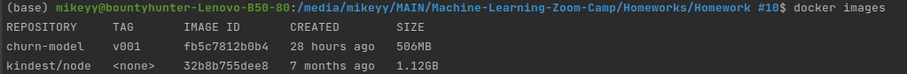

# Basic Working
 - create a program
 - create a `Dockerfile`, add a custom tag
 - install `kind` and `kubectl`
 - `kind create cluster`
 - configure our `kubectl` to access the `kind-kind cluster` - `kubectl cluster-info -context kind-kind`
 - to check things work
     - `kubectl get service` - list all the services running in our kubernetes cluster
     - `kubectl get pod` to get the pods
     - `kubectl get deployment`to get the deployment
 - `kind` uses docker to create a kubernetes cluster. The way it’s implemented it just runs docker things and it feels like we’re interacting with a real kubernetes cluster, useful for testing locally

---

 install the kubernetes extension

## Load image to a cluster:

- `kind load docker-image <image-name>:<image-tag>`

## **create deployment**: 
here we specify how the pods in the deployment will look like

- we will use that config `.yaml` file and apply it to our kubernetes cluster

`kubectl apply -f deployment.yaml`

- use `kubectl get deployment` to see the deployment

⇒ test deployment without a service using port forwarding

`kubectl port-forward <pod-name> 9696:9696` (local port: port on the pod)

- then use `curl localhost:9696/ping`

## create a service

- external is load balance and internal is clusterIp
- after creating the service.yaml file again do `kubectl apply -f  service.yaml`

 - when using kite we’ll have <pending> in LoadBalancer because we use local kubernetes cluster we’ve not configured it to be able to get an external ip so it will be pending forever unless we configure something ofc. if we use eks or something(other kubernetes from any cloud provider) then kubernetes clusters there will assign an external name our load balancer 

- now we will use port forwarding for the service  cause we don’t have an external ip
- -`service/ping` is the service name which can be found using `kubectl get svc`
- `kubectl port-forward service/ping 8080:80`

 `curl localhost:8080/ping`

to see errors description or other description use `kubectl describe pod <pod-name>`

# WORKING
`$ kind load docker-image churn-model:v001`
Image: "churn-model:v001" with ID "sha256:fb5c7812b0b4952e3da7a369c45d1bdefcd5f3442a6ae88645ce6925d16bea34"  not yet present on node "kind-control-plane", loading...
### `$ docker images` 

### `$ kubectl apply -f deployment.yaml`
deployment.apps/churn created
 
### `$ kubectl apply -f service.yaml `
service/churn created
### `$ kubectl port-forward service/churn 9696:80`
Forwarding from 127.0.0.1:9696 -> 9696  
Forwarding from [::1]:9696 -> 9696
Handling connection for 9696
### `$ python predict-test.py `
{'churn': False, 'churn_probability': 0.3257561103397851}  
not sending promo email to xyz-123
